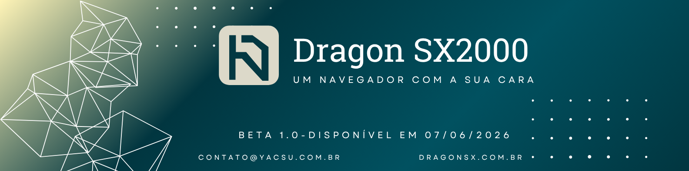

<p align="center">
  
</p>

<h1 align="center">Dragon SX2000</h1>

<p align="center">
  <strong>Beta 1.0</strong>
</p>

<p align="center">
  <em>Disponível em 07/06/2026</em>
</p>

<p align="center">

  <!-- Electron -->
  <a href="https://www.electronjs.org/" target="_blank">
    
  </a>

  <!-- Node.js -->
  <a href="https://nodejs.org/" target="_blank">
    
  </a>

  <!-- JavaScript -->
  <a href="https://developer.mozilla.org/docs/Web/JavaScript" target="_blank">
    
  </a>

  <!-- HTML5 -->
  <a href="https://developer.mozilla.org/docs/Web/HTML" target="_blank">
    
  </a>

  <!-- CSS3 -->
  <a href="https://developer.mozilla.org/docs/Web/CSS" target="_blank">
    
  </a>

  <!-- Express -->
  <a href="https://expressjs.com/" target="_blank">
    
  </a>

  <!-- WebSocket -->
  <a href="https://developer.mozilla.org/docs/Web/API/WebSockets_API" target="_blank">
    
  </a>

</p>

---

## Sobre o Projeto

O **Dragon SX2000** é um navegador desktop **open source** pensado para quem quer ir além do comum. Aqui, cada detalhe pode refletir a sua identidade — porque um navegador não precisa ser genérico; ele pode ser **a cara do dono**.

Personalize a tela inicial, escolha wallpapers, ajuste temas, adicione widgets e deixe o ambiente exatamente do jeito que você imagina. O Dragon SX2000 nasceu da ideia de que navegar na web também é uma forma de se expressar.

---

## Funcionalidades da Versão 1.0

- Tela inicial **Home** totalmente personalizável
- Sistema completo de **abas** com drag-and-drop e animações
- **Persistência de dados** para salvar preferências e configurações
- Busca integrada com o **Google** em múltiplos pontos da interface
- Sistema de **Auto Tunes** — widgets flutuantes de produtividade e entretenimento
- Suporte a **imagens e vídeos** como wallpaper
- **Factory** de personalização visual e CSS/SCSS por componente
- **Dragon Media SDK** — now playing em tempo real via WebSocket

> Para o changelog completo desta versão, consulte [`Version/Lançamento/Log 1.0.MD`](Version/Lançamento/Log%201.0.MD).

---

## Como Executar

### Pré-requisitos

- Node.js (versão LTS recomendada)
- npm

### Instalação

```bash
git clone https://github.com/Yacsu77/Dragon-SX2000.git
cd Dragon-SX2000
npm install
```

### Executar

```bash
npm start
```

---

## Contato

| | |
|---|---|
| **E-mail** | [contato@yacsu.com.br](mailto:contato@yacsu.com.br) |
| **Site** | [DragonSX.com.br](https://dragonsx.com.br) |

---

<p align="center">
  <sub>
    © 2026 — Todos os direitos reservados a <strong>Pedro Henrique Carneichuk Rosa</strong>
  </sub>
</p>
