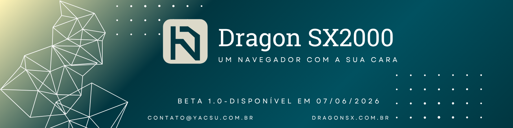

<p align="center">
  
</p>

<h1 align="center">DSX</h1>

<p align="center">
  <strong>v1.3.0 Beta</strong>
</p>

<p align="center">
  <em>Lançamento: Jul/2026</em>
</p>

<p align="center">
  <a href="https://github.com/Yacsu77/Dragon-SX2000/releases">
    
  </a>
</p>

<p align="center">

  <!-- Electron -->
  <a href="https://www.electronjs.org/" target="_blank">
    
  </a>

  <!-- Node.js -->
  <a href="https://nodejs.org/" target="_blank">
    
  </a>

  <!-- JavaScript -->
  <a href="https://developer.mozilla.org/docs/Web/JavaScript" target="_blank">
    
  </a>

  <!-- HTML5 -->
  <a href="https://developer.mozilla.org/docs/Web/HTML" target="_blank">
    
  </a>

  <!-- CSS3 -->
  <a href="https://developer.mozilla.org/docs/Web/CSS" target="_blank">
    
  </a>

  <!-- Express -->
  <a href="https://expressjs.com/" target="_blank">
    
  </a>

  <!-- WebSocket -->
  <a href="https://developer.mozilla.org/docs/Web/API/WebSockets_API" target="_blank">
    
  </a>

</p>

---

## Sobre o Projeto

O **DSX** (sucessor do Dragon SX2000) é um navegador desktop **open source** pensado para quem quer ir além do comum. Cada detalhe pode refletir a sua identidade — wallpapers, temas, widgets AutoTune e uma interface modular feita para personalização.

---

## Versão e downloads

| | |
|---|---|
| **Versão disponível** | **v1.3.0 Beta** |
| **Lançamento** | **Jul/2026** |
| **Executáveis** | Somente via [GitHub Releases](https://github.com/Yacsu77/Dragon-SX2000/releases) |

Os instaladores são publicados na branch `main` com o prefixo **DSX**:

- Windows: `DSX-1.3.0-win-x64.exe`
- macOS: `DSX-1.3.0-mac-x64.dmg` / `arm64`
- Linux: `DSX-1.3.0-linux-x64.deb` e `.AppImage`

Não há distribuição de binários fora do Release.

---

## Funcionalidades (v1.3)

- **Home** com wallpaper visível e widgets AutoTune flutuantes
- Sistema de **abas** com drag-and-drop, animações e visão geral estilo Safari
- **Barra superior** modular: menu, histórico, favoritos, arquivos locais, downloads
- Busca integrada com o **Google** na barra de endereço
- **Favoritos** com persistência em localStorage
- **AutoTune** — widgets flutuantes (Timer, Music, Clock, Share, Tasklist)
- **AutoTune Music minimal** — player compacto no topo com volume integrado ao SDK
- **Wallpaper** com imagem e vídeo — persistência em disco (`userData/wallpapers/`)
- **Factory** de personalização visual por componente
- **Dragon Media SDK** — now playing, controles e volume em tempo real via WebSocket
- **Atalhos globais** de teclado e mouse ([documentação](Frontend/src/shortcuts/README.md)) — Tela de Atalhos, Ctrl+Space/T/W/H/R, botões extras
- **Tela Editar** — opção de manter abas renderizadas (desempenho)
- Prefetch de conexão, cache persistente de webviews e troca de aba sem flash

> Changelog completo: [`Version/Lançamento/Log v1.3.MD`](Version/Lançamento/Log%20v1.3.MD)  
> Documentação do Frontend: [`Version/Docs/Frontend/Inicial.MD`](Version/Docs/Frontend/Inicial.MD)

---

## Como Executar (desenvolvimento)

### Pré-requisitos

- Node.js (versão LTS recomendada)
- npm

### Instalação

```bash
git clone https://github.com/Yacsu77/Dragon-SX2000.git
cd Dragon-SX2000
npm install
```

### Executar

```bash
npm start
```

### Build local

```bash
npm run dist:win    # Windows
npm run dist:mac    # macOS
npm run dist:linux  # Linux
```

---

## Contato

| | |
|---|---|
| **E-mail** | [contato@yacsu.com.br](mailto:contato@yacsu.com.br) |
| **Site** | [DragonSX.com.br](https://dragonsx.com.br) |

---

<p align="center">
  <sub>
    © 2026 — Todos os direitos reservados a <strong>Pedro Henrique Carneichuk Rosa</strong>
  </sub>
</p>
